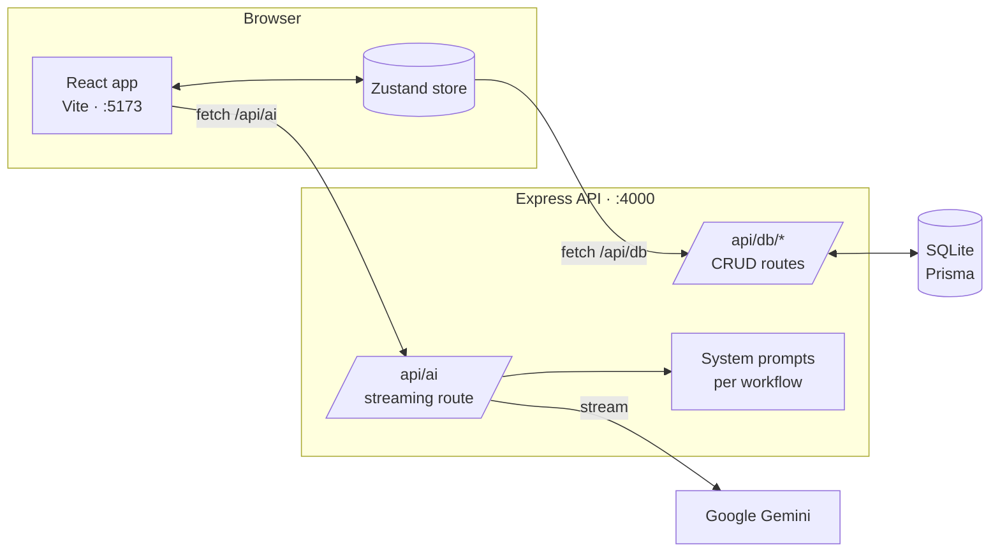

# Prodly

**An AI-powered workspace for product managers.** Write PRDs and user stories, plan roadmaps, prioritize features and turn raw research or metrics into insights, with an AI co-pilot that knows which document you're working on.

---

## Features

| Area | What you can do |
|------|-----------------|
| **Document editor** | Rich-text editor (Tiptap) with headings, tables, highlights and `/` slash-command templates. Autosaves as you type. |
| **File explorer** | Organise documents in folders. Create, rename and delete PRDs, user stories, research notes, roadmap docs and general notes. |
| **AI co-pilot** | Streaming chat with seven specialised modes: **PRD**, **User Stories**, **Roadmap**, **Prioritization**, **Research**, **Data** and **General chat**. Can use the open document as context and write its answer straight into the editor. |
| **Roadmap board** | Kanban board (Now / Next / Later / Done) with drag-and-drop feature cards. |
| **Prioritization** | RICE scoring table and a MoSCoW board, plus an AI score assistant. |
| **Research synthesizer** | Paste interview notes or feedback. The AI extracts themes, frequency and supporting quotes. |
| **Data analysis** | Paste or upload CSV metrics and get an AI-written analysis. |
| **Command palette & shortcuts** | `⌘K` for AI actions and new documents, `?` for the full shortcut list. |
| **Export** | Copy a document as Markdown or plain text, or download it as a `.md` file. |

### Keyboard shortcuts

| Shortcut | Action |
|----------|--------|
| `⌘K` | Open AI command palette |
| `⌘N` | New document |
| `⌘S` | Save document |
| `⌘/` | Toggle AI sidebar |
| `/` | Insert a template (in the editor) |
| `?` | Show all keyboard shortcuts |

---

## Tech stack

| Layer | Technology |
|-------|-----------|
| Frontend | React 18, Vite, TypeScript, Tailwind CSS, Zustand, Tiptap, dnd-kit, Recharts, Radix UI |
| Backend | Node.js, Express 5, TypeScript |
| Database | SQLite via Prisma ORM |
| AI | Google Gemini (`@google/genai`), streamed to the browser |
| Tests | Node's built-in test runner (`node:test`) via `tsx` |

## Architecture



- In development, Vite proxies every `/api` request to the Express server, so the frontend only uses relative URLs.
- The Zustand store updates the UI immediately (optimistic updates) and syncs each change to the API in the background.
- `/api/ai` builds a system prompt for the chosen workflow, adds the open document as context, and streams Gemini's reply back as plain text chunks.
- If Gemini is temporarily overloaded (HTTP 429/500/503), the server retries up to 3 times with backoff before returning an error.

---

## Getting started

### Prerequisites

- **Node.js 20+** and npm
- A **Gemini API key** from [Google AI Studio](https://aistudio.google.com/apikey)

### 1. Install

```bash
git clone https://github.com/Ratangulati/Prodly.git
cd Prodly
npm install
```

### 2. Configure environment

```bash
cp server/.env.example server/.env
```

Then open `server/.env` and set your key:

```env
GEMINI_API_KEY=your-key-here
DATABASE_URL="file:./dev.db"
```

### 3. Set up the database

```bash
cd server
npx prisma generate          # generate the Prisma client
npx prisma migrate dev       # create the SQLite database
cd ..
npm run db:seed              # load the demo workspace
```

### 4. Run

```bash
npm run dev
```

| Service | URL |
|---------|-----|
| App (frontend) | http://localhost:5173 |
| API (backend) | http://localhost:4000 |
| Health check | http://localhost:4000/api/health |

---

## Environment variables

All variables go in `server/.env`.

| Variable | Required | Default | Description |
|----------|----------|---------|-------------|
| `GEMINI_API_KEY` | Yes | — | Google Gemini API key |
| `DATABASE_URL` | Yes | `file:./dev.db` | SQLite file path, relative to `server/prisma/` |
| `GEMINI_MODEL` | No | `gemini-3.8-flash` | Gemini model to use |
| `PORT` | No | `4000` | API server port |
| `CLIENT_ORIGIN` | No | `http://localhost:5173` | Origin allowed by CORS |

---

## Scripts

Run these from the project root.

| Command | Description |
|---------|-------------|
| `npm run dev` | Start the backend and frontend together, with hot reload |
| `npm test` | Run the backend API test suite |
| `npm run typecheck` | Type-check the backend and frontend |
| `npm run build` | Compile the backend (`server/dist`) and build the frontend (`client/dist`) |
| `npm start` | Start the compiled backend |
| `npm run db:seed` | Load the demo workspace (skipped if data already exists) |
| `npm run db:reset` | Wipe the database and reseed it |

---

## Project structure

```
Prodly/
├── client/                      # React frontend (Vite)
│   ├── index.html
│   ├── vite.config.ts           # dev server + /api proxy
│   └── src/
│       ├── main.tsx             # entry point
│       ├── App.tsx
│       ├── components/
│       │   ├── AppShell.tsx     # three-panel layout
│       │   ├── editor/          # Tiptap editor, toolbar, export
│       │   ├── sidebar/         # file explorer, AI chat, research, data panels
│       │   ├── roadmap/         # kanban roadmap board
│       │   ├── prioritization/  # RICE & MoSCoW views
│       │   ├── modals/          # command palette, keyboard shortcuts
│       │   ├── onboarding/      # welcome screen
│       │   └── ui/              # shared UI primitives
│       ├── lib/
│       │   ├── store.ts         # Zustand store + API sync
│       │   └── types.ts         # shared types
│       └── data/                # mock data
│
├── server/                      # Express backend
│   ├── src/
│   │   ├── index.ts             # starts the server
│   │   ├── app.ts               # Express app, middleware, error handling
│   │   ├── routes/              # ai, documents, features, filenodes, insights, messages
│   │   └── lib/
│   │       ├── ai.ts            # Gemini streaming client + retries
│   │       ├── prompts.ts       # system prompt for each AI workflow
│   │       └── prisma.ts        # Prisma client
│   ├── prisma/
│   │   ├── schema.prisma        # data model
│   │   ├── migrations/
│   │   └── seed.ts              # demo workspace
│   └── test/api.test.ts         # API test suite
│
└── package.json                 # npm workspaces + root scripts
```

---

## API reference

All endpoints are served under `/api`. Request and response bodies are JSON unless noted.

### Health

| Method | Path | Response |
|--------|------|----------|
| `GET` | `/api/health` | `{ "ok": true }` |

### AI

`POST /api/ai` streams the reply as `text/plain`.

```json
{
  "workflow": "prd",
  "userMessage": "Write a PRD for an onboarding checklist",
  "documentContext": "<optional: contents of the open document>",
  "conversationHistory": [
    { "role": "user", "content": "..." },
    { "role": "assistant", "content": "..." }
  ]
}
```

- `workflow` is one of `prd`, `stories`, `roadmap`, `prioritization`, `research`, `data`, `general` (default `general`).
- Errors: `400` if `userMessage` is missing or the workflow is unknown; `502` if Gemini fails.

### Data

| Resource | List / create | Update / delete |
|----------|---------------|-----------------|
| Documents | `GET` `POST` `/api/db/documents` | `PATCH` `DELETE` `/api/db/documents/:id` |
| Features | `GET` `POST` `/api/db/features` | `PATCH` `DELETE` `/api/db/features/:id` |
| Research insights | `GET` `POST` `/api/db/insights` | `PATCH` `DELETE` `/api/db/insights/:id` |
| File tree nodes | `GET` `POST` `/api/db/filenodes` | `PATCH` `DELETE` `/api/db/filenodes/:id` |
| AI messages | `GET` `POST` `/api/db/messages` | `DELETE` `/api/db/messages` with body `{ "workflow": "prd" }` clears one workflow; no body clears all |

`PATCH` updates only the fields you send. Missing records return `404`, and malformed or invalid bodies return `400`.

### Data model

| Model | Key fields |
|-------|-----------|
| `Document` | `title`, `content` (HTML), `type` (`prd` · `user-story` · `research` · `roadmap` · `general`), `tags[]` |
| `Feature` | `title`, `status` (`Now` · `Next` · `Later` · `Done`), `priority` (`P0`–`P3`), RICE fields (`reach`, `impact`, `confidence`, `effort`, `riceScore`), `moscow`, `assignee`, `dueDate`, `linkedDocId` |
| `ResearchInsight` | `theme`, `summary`, `quotes[]`, `frequency`, `linkedFeatures[]` |
| `FileNode` | `name`, `type` (`folder` or a document type), `parentId`, `children[]` (ordered IDs) |
| `AIMessage` | `role` (`user` · `assistant`), `content`, `workflow`, `timestamp` |

---

## Testing

```bash
npm test
```

The suite (`server/test/api.test.ts`) starts the real Express app on a random port against a **throwaway SQLite database**, reseeds it before every test, and replaces Gemini with a fake. It never touches your data or your API quota. It covers:

- every CRUD endpoint (create, partial update, delete) for all five resources
- `404` for missing records and `400` for malformed JSON or unknown fields
- clearing chat history per workflow
- AI streaming, prompt building (including document context), all seven workflow prompts, input validation, and the `502` response when the provider fails

---

## Troubleshooting

| Problem | Fix |
|---------|-----|
| AI replies "Sorry, something went wrong" | Check the server logs. **503** means Gemini is overloaded (usually temporary; the server already retries 3 times). **429** means your API key has hit its quota. **404** means the model was retired, so set `GEMINI_MODEL` to a current one. |
| `@prisma/client did not initialize yet` | Run `cd server && npx prisma generate`. Newer npm versions may skip Prisma's install script. |
| Empty workspace on first run | Run `npm run db:seed`. |
| Port 4000 or 5173 already in use | Stop the other process, or set `PORT` in `server/.env` (and update the proxy target in `client/vite.config.ts`). |
