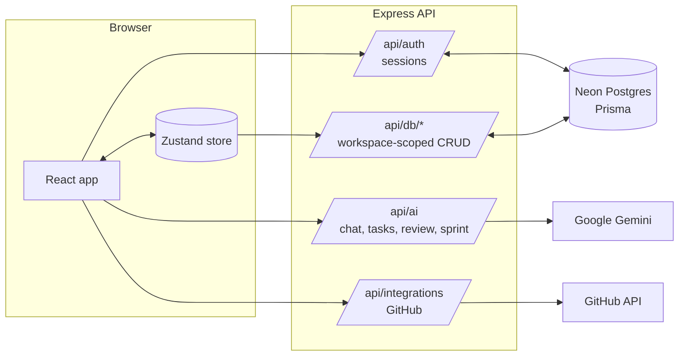

# Prodly

**An AI-powered workspace for product managers.** Write PRDs, turn them into tasks, plan sprints and roadmaps, synthesise research, and keep stakeholders updated, with an AI co-pilot that works from your team's real data.

**Live:** https://prodly-henna.vercel.app (create an account to start your own workspace)

---

## Features

### Plan and write

| Feature | What you can do |
|---------|-----------------|
| **Document editor** | Rich-text editor (Tiptap) with headings, tables, highlights and `/` templates. Autosaves as you type. |
| **Version history** | Every document keeps saved versions: one before each AI change and one every ~10 minutes while you type. Preview any version and restore it. |
| **AI co-pilot** | Streaming chat with seven modes: **PRD**, **User Stories**, **Roadmap**, **Prioritization**, **Research**, **Data** and **General chat**. AI edits to a document are proposals: **Accept**, **Insert below** or **Discard**, with a diff and **Undo**. |
| **PRD quality check** | Scores a PRD out of 100 across ten areas (problem, metrics, scope, edge cases, rollout…). **Fix with AI** drafts the improvement in the PRD chat. |
| **Export** | Markdown, plain text, **Save as PDF** (via the print dialog) and **Word / Google Docs (.doc)**. |

### Deliver

| Feature | What you can do |
|---------|-----------------|
| **PRD → tasks** | **Generate tasks** reads a PRD and proposes tasks with priorities and estimates. Review, edit and assign them before they're added. Tasks already on the board are flagged. |
| **Tasks board** | Kanban (To Do / In Progress / Review / Done). Drag to move and reorder, click a card to edit everything, double-click to rename. Filter by person, **My tasks**, PRD, sprint or text. |
| **AI sprint planning** | Set each teammate's capacity; the AI proposes what fits, who takes it and why, and what to defer. Adjust, then start the sprint. **Complete sprint** returns unfinished work to the backlog. |
| **Stakeholder updates** | Writes a status update for your team, leadership or Slack from completed, in-progress and overdue work, the roadmap and research. Copy it or save it as a document. |
| **GitHub Issues export** | Export a task, or every open task in the current view, as GitHub issues. Each task links to its issue. |

### Discover and decide

| Feature | What you can do |
|---------|-----------------|
| **Research synthesizer** | Paste interview notes; the AI extracts themes, frequency and quotes. Saved insights can **Create feature** or **Link feature** on the roadmap. |
| **Roadmap board** | Now / Next / Later / Done with drag-and-drop. Click a card to edit it, including RICE inputs. Cards show their **research evidence** (how many users asked for it). |
| **Prioritization** | RICE table and MoSCoW board, plus an AI score assistant. |
| **Data analysis** | Paste or upload CSV metrics for an AI-written analysis. |

### Work as a team

| Feature | What you can do |
|---------|-----------------|
| **Accounts & workspaces** | Sign up to start a workspace, or join a teammate's with their invite code. Every workspace's data is private to its members. |
| **Comments & @mentions** | Discuss any task or document. Type `@` to mention a teammate; they see it in the **Mentions** inbox (bell icon). |
| **Home dashboard** | Your tasks, overdue work, workload per person, sprint and PRD progress, roadmap, top research themes and recent mentions. |
| **Search** | `⌘K` searches documents, tasks, roadmap features and research. |
| **Works everywhere** | Below 1024px wide the app switches to a single-panel layout with a bottom tab bar. Light and dark themes. |

### Keyboard shortcuts

| Shortcut | Action |
|----------|--------|
| `⌘K` | Search, AI workflows and new documents |
| `⌘N` | New document |
| `⌘/` | Cycle the AI sidebar tabs |
| `/` | Insert a template (in the editor) |
| `Enter` / `Shift+Enter` | Send / new line (chat and comments) |
| `?` | Show all keyboard shortcuts |

---

## Tech stack

| Layer | Technology |
|-------|-----------|
| Frontend | React 18, Vite, TypeScript, Tailwind CSS, Zustand, Tiptap, dnd-kit, Radix UI |
| Backend | Node.js, Express 5, TypeScript |
| Database | Postgres ([Neon](https://neon.tech), via the Vercel Marketplace) with Prisma ORM |
| Hosting | Vercel: the React app on the CDN, Express as a Vercel Function (Services) |
| Auth | Email + password (scrypt), HTTP-only session cookies |
| AI | Google Gemini (`@google/genai`): streamed chat, and JSON-schema output for planning features |
| Tests | Node's built-in test runner (`node:test`) via `tsx`, on an in-memory Postgres ([PGlite](https://pglite.dev)) |

## Architecture



- **Workspaces:** every table carries a `workspaceId`, and every `/api/db`, `/api/ai` and `/api/integrations` route requires a session and only touches the signed-in user's workspace.
- **Optimistic UI:** the Zustand store updates immediately and syncs each change to the API in the background. A `401` sends the user back to sign in.
- **AI you can trust:** planning features use Gemini's JSON-schema mode, and the server validates the output. For example, sprint plans are re-checked against real tasks, people and capacity.
- **Resilience:** when a Gemini model is overloaded, rate-limited, unavailable or stuck, the server quickly moves down a chain of models (`GEMINI_MODEL`, then `GEMINI_FALLBACK_MODELS`), with a time limit on each attempt. Planning features use low "thinking" effort, so they answer in seconds. Errors reach the user as plain messages ("AI quota reached…"), and each user has a daily AI request limit.
- **Development vs production:** in development, Vite serves the app and proxies `/api` to Express. On Vercel, the frontend service serves the React app and `/api/*` is routed to the backend service.
- **One database, separate schemas:** production uses the default schema, local development the `dev` schema, and tests an in-memory Postgres, so they never mix.

---

## Getting started

### Prerequisites

- **Node.js 22+** and npm
- The **Vercel CLI**, signed in with access to the `prodly` project (`npm i -g vercel@latest`, then `vercel login`)
- A **Gemini API key** from [Google AI Studio](https://aistudio.google.com/apikey)

### Setup

```bash
git clone https://github.com/Ratangulati/Prodly.git
cd Prodly
npm install

vercel link --project prodly            # connect this folder to the Vercel project
cp server/.env.example server/.env      # then set GEMINI_API_KEY
npm run env:pull                        # adds the database settings (uses the "dev" schema)

cd server && npx prisma generate && npx prisma migrate deploy && cd ..
npm run db:seed                         # demo workspace, team, tasks and login

npm run dev
```

Open http://localhost:5173 and sign in with the demo account **demo@prodly.dev** / **prodly-demo**, or create your own account. The demo login only exists locally; on the live site everyone signs up for their own workspace.

| Service | URL |
|---------|-----|
| App | http://localhost:5173 |
| API | http://localhost:4000 |
| Health check | http://localhost:4000/api/health |

---

## Environment variables

Locally they go in `server/.env`; in production they're set in the Vercel project (Settings → Environment Variables).

| Variable | Required | Default | Description |
|----------|----------|---------|-------------|
| `GEMINI_API_KEY` | Yes | — | Google Gemini API key |
| `POSTGRES_PRISMA_URL` | Yes | — | Pooled Postgres connection for the app. Set by the Neon integration; `npm run env:pull` writes it locally |
| `DATABASE_URL_UNPOOLED` | Yes | — | Direct Postgres connection, used for migrations. Set the same way |
| `GEMINI_MODEL` | No | `gemini-3.8-flash` | Main Gemini model |
| `GEMINI_FALLBACK_MODELS` | No | `gemini-3.5-flash,gemini-flash-lite-latest` | Models tried in order when the main one fails; empty turns fallback off |
| `GEMINI_ATTEMPT_TIMEOUT_MS` | No | `30000` | Time limit per model attempt for planning features |
| `AI_DAILY_LIMIT` | No | `100` | AI requests per user per day (UTC) |
| `GITHUB_TOKEN` | No | — | Token that can create issues (fine-grained: *Issues: read & write*) |
| `GITHUB_REPO` | No | — | `owner/repo` that tasks are exported to |
| `PORT` | No | `4000` | Server port |
| `CLIENT_ORIGIN` | No | `http://localhost:5173` | Origin allowed by CORS in development |
| `SEED_DEMO` | No | — | Production only: `true` seeds the demo workspace and login on start |
| `SHOW_DEMO_LOGIN` | No | — | Production only: `true` shows the demo login on the sign-in screen |

GitHub export is configured per server, so all workspaces on a server export to the same repository.

---

## Scripts

Run these from the project root.

| Command | Description |
|---------|-------------|
| `npm run dev` | Start the backend and frontend together, with hot reload |
| `npm test` | Run the API test suite |
| `npm run typecheck` | Type-check the backend and frontend |
| `npm run build` | Build the backend (`server/dist`) and frontend (`client/dist`) |
| `npm start` | Start the built backend |
| `npm run env:pull` | Write the database settings from Vercel into `server/.env` (dev schema) |
| `npm run db:migrate` | Create a new migration after changing `schema.prisma` (dev schema) |
| `npm run db:seed` | Add the demo data (skips anything that already exists) |
| `npm run db:reset` | Wipe the dev schema and reseed it |

---

## Deployment (Vercel)

Prodly runs on Vercel as one project with two **services** (see `vercel.json`):

- **frontend**: the Vite build of `client/`, served from the CDN. Deep links fall back to `index.html`.
- **backend**: the Express app in `server/`, running as a Vercel Function. It handles every `/api/*` request.

The database is **Neon Postgres**, added from the Vercel Marketplace, which sets `POSTGRES_PRISMA_URL` and `DATABASE_URL_UNPOOLED` on the project automatically. `GEMINI_API_KEY` is set in the project's environment variables.

To ship a change:

```bash
# 1. If the database schema changed, apply migrations to production first
vercel env pull .env.production.local --environment=production
(set -a; . ./.env.production.local; set +a; cd server && npx prisma migrate deploy)
rm .env.production.local

# 2. Deploy
vercel deploy --prod
```

- The demo login is **off** in production: everyone creates their own account and workspace. (Setting `SEED_DEMO=true` and `SHOW_DEMO_LOGIN=true` would enable a shared public demo account.)
- Session cookies are `Secure` in production, and Vercel serves everything over HTTPS.
- On the free Gemini tier, a public site will hit rate limits quickly. Enable billing on the key's Google project for real users.

### Other hosts (Docker)

The `Dockerfile` builds a single container that serves the API and the React app, for hosts that run containers. Give it a Postgres database:

```bash
docker build -t prodly .
docker run -p 8080:8080 \
  -e GEMINI_API_KEY=... -e POSTGRES_PRISMA_URL=... -e DATABASE_URL_UNPOOLED=... \
  prodly
```

On start, the container applies database migrations, then starts the server on port 8080.

---

## Project structure

```
Prodly/
├── client/                        # React frontend (Vite)
│   └── src/
│       ├── App.tsx                # sign-in gate → AppShell
│       ├── components/
│       │   ├── AppShell.tsx       # three-panel layout, or single panel on small screens
│       │   ├── auth/              # sign in / create account
│       │   ├── dashboard/         # home dashboard
│       │   ├── editor/            # editor, export, version history, PRD quality check
│       │   ├── tasks/             # board, task details, team, PRD → tasks, sprints, updates
│       │   ├── comments/          # comment threads, @mention input, mentions inbox
│       │   ├── sidebar/           # file explorer, AI chat, research, data, account menu
│       │   ├── roadmap/           # roadmap board and feature editor
│       │   ├── prioritization/    # RICE and MoSCoW
│       │   └── modals/            # search / command palette, shortcuts
│       └── lib/                   # store, auth, AI and comments clients, search, export helpers
│
├── server/                        # Express backend
│   ├── src/
│   │   ├── index.ts               # starts the server (and serves client/dist in production)
│   │   ├── app.ts                 # middleware, routes, error handling
│   │   ├── routes/                # auth, ai, documents, features, filenodes, insights,
│   │   │                          # messages, tasks, members, comments, sprints, integrations
│   │   └── lib/                   # auth/sessions, AI client, prompts, planning, versions,
│   │                              # usage limits, GitHub, Prisma client
│   ├── prisma/                    # schema, migrations, seed
│   └── test/api.test.ts           # API test suite
│
├── Dockerfile                     # production image
└── package.json                   # npm workspaces + root scripts
```

---

## API reference

All endpoints are under `/api` and use JSON. Everything except `/api/health` and `/api/auth/*` needs a session cookie, and only reads and writes the signed-in user's workspace.

### Auth

| Method | Path | Notes |
|--------|------|-------|
| `POST` | `/api/auth/register` | `{ name, email, password, workspaceName? , joinCode? }`: starts a workspace, or joins one with an invite code |
| `POST` | `/api/auth/login` | `{ email, password }` |
| `POST` | `/api/auth/logout` | Ends the current session |
| `GET` | `/api/auth/me` | `{ user, workspace }` |
| `GET` | `/api/auth/config` | Whether a demo login is advertised |

### Data

| Resource | Endpoints |
|----------|-----------|
| Documents | `GET` `POST` `/db/documents` · `PATCH` `DELETE` `/db/documents/:id` · `GET` `/db/documents/:id/versions` · `POST` `/db/documents/:id/versions/:versionId/restore` |
| Tasks | `GET` `POST` `/db/tasks` · `POST` `/db/tasks/bulk` · `PATCH` `DELETE` `/db/tasks/:id` |
| Team members | `GET` `POST` `/db/members` · `PATCH` `DELETE` `/db/members/:id` |
| Sprints | `GET` `POST` `/db/sprints` (start, with task assignments) · `PATCH` `/db/sprints/:id` · `POST` `/db/sprints/:id/complete` |
| Comments | `GET` `/db/comments?targetType=task\|document&targetId=` · `GET` `/db/comments/counts` · `GET` `/db/comments/mentions` · `POST` `/db/comments` · `PATCH` `DELETE` `/db/comments/:id` (author only) |
| Features | `GET` `POST` `/db/features` · `PATCH` `DELETE` `/db/features/:id` |
| Research insights | `GET` `POST` `/db/insights` · `PATCH` `DELETE` `/db/insights/:id` |
| File tree | `GET` `POST` `/db/filenodes` · `PATCH` `DELETE` `/db/filenodes/:id` |
| AI chat history | `GET` `POST` `DELETE` `/db/messages` (`{ workflow }` clears one workflow) |

`PATCH` updates only the fields you send; unknown fields are ignored. Missing records return `404`, and invalid input returns `400` with an `error` message.

### AI

| Method | Path | Returns |
|--------|------|---------|
| `POST` | `/api/ai` | Streams a plain-text reply. `{ workflow, userMessage, documentContext?, conversationHistory? }`, where `workflow` is `prd`, `stories`, `roadmap`, `prioritization`, `research`, `data`, `general` or `update` |
| `POST` | `/api/ai/tasks` | `{ tasks: [{ title, description, priority, estimate }] }` proposed from `{ title, content }` of a PRD |
| `POST` | `/api/ai/review` | `{ score, summary, checks: [{ area, status, feedback }] }` for a PRD |
| `POST` | `/api/ai/sprint` | `{ goal, committed, deferred }` from `{ capacity: { [memberId]: points } }` |

Nothing is saved by these endpoints; the user approves results first. Errors: `400` for bad input, `429` when the daily AI limit is reached, `502` with a readable message if Gemini fails.

### Integrations

| Method | Path | Notes |
|--------|------|-------|
| `GET` | `/api/integrations` | `{ github: { repo } \| null }` |
| `POST` | `/api/integrations/github/issues` | `{ taskIds }` → per-task `{ url }` or `{ error }`. Already-exported tasks are skipped. |

---

## Testing

```bash
npm test
```

78 tests run in about 10 seconds. They run the real Express app against an **in-memory Postgres** (PGlite), with fakes for Gemini and GitHub, so they need no database setup and never touch your data, API quota or repositories. They cover:

- sign-up, sign-in, sessions, invite codes, and **workspace isolation** (one workspace can't read or change another's data)
- every CRUD endpoint, partial updates, validation and `404`/`400` handling
- version history (snapshot rules, restore, privacy)
- comments, @mentions, author-only editing and cleanup when a task or document is deleted
- sprints: AI plans checked against real tasks and capacity, start/complete, one active sprint at a time
- AI streaming, prompts for every workflow, PRD → tasks, PRD review, readable errors and the daily limit
- GitHub export (request format, saved links, skipping duplicates, error handling)
- AI model fallback: retries, timeouts, skipping unavailable models
- production serving of the built app

---

## Troubleshooting

| Problem | Fix |
|---------|-----|
| "The AI model is busy right now" | Every model in the fallback chain was busy. It's usually temporary; try again in a minute, or add more models to `GEMINI_FALLBACK_MODELS`. |
| "AI quota reached" | Your Gemini key hit its limit. Wait, or check your plan in Google AI Studio. |
| "You've reached today's limit of N AI requests" | The per-user daily limit. Raise `AI_DAILY_LIMIT` if needed. |
| "The configured AI model is not available" | The model was retired. Set `GEMINI_MODEL` to a current one. |
| Can't connect to the database locally | Run `npm run env:pull` (after `vercel link --project prodly`), then `cd server && npx prisma migrate deploy`. |
| `@prisma/client did not initialize yet` | Run `cd server && npx prisma generate`. Newer npm versions may skip Prisma's install script. |
| GitHub export errors | Check that `GITHUB_TOKEN` can create issues in `GITHUB_REPO`, and that issues are enabled on the repository. |
| Port 4000 or 5173 already in use | Stop the other process, or set `PORT` (and update the proxy target in `client/vite.config.ts`). |
